# CODEX CHESS

<p align="center">
  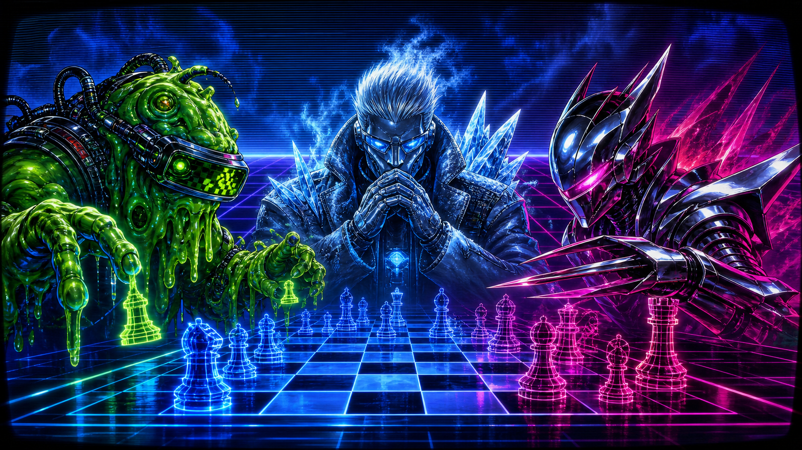
</p>

<p align="center">
  <strong>OFFICIAL CYBERSPACE INSTRUCTION BOOKLET</strong><br>
  For one player. Browser required. No cartridge blowing necessary.
</p>

<p align="center">
  <a href="https://newjordan.github.io/codex-chess/">PLAY THE GAME</a>
  &nbsp;|&nbsp;
  <a href="media/chessagent-intro.mp4">WATCH THE INTRO MP4</a>
</p>

---

## OPENING CINEMA

<p align="center">
  <a href="media/chessagent-intro.mp4">
    
  </a>
</p>

<video src="media/chessagent-intro.mp4" controls width="900"></video>

If the video player does not appear in your browser, open `media/chessagent-intro.mp4`.

---

## THE STORY SO FAR

Before the age of neon boards, the greatest chess mind alive chased a forbidden rumor hidden deep in computation: the Shannon Prime.

Then the Shannon Knights struck.

<table>
  <tr>
    <td width="50%">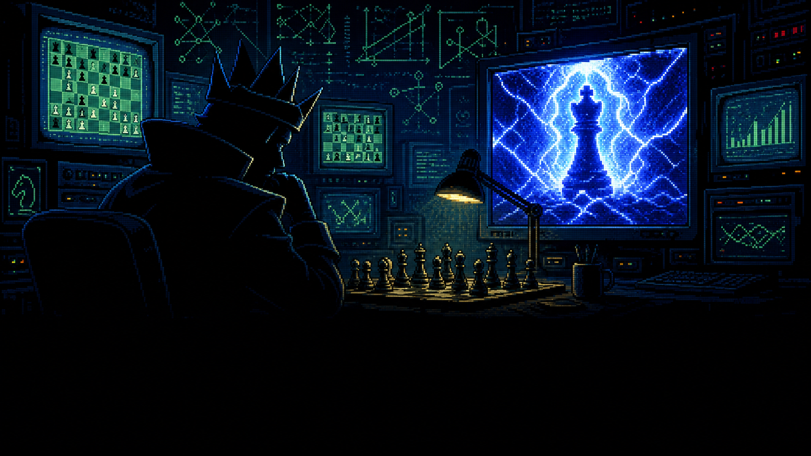</td>
    <td width="50%">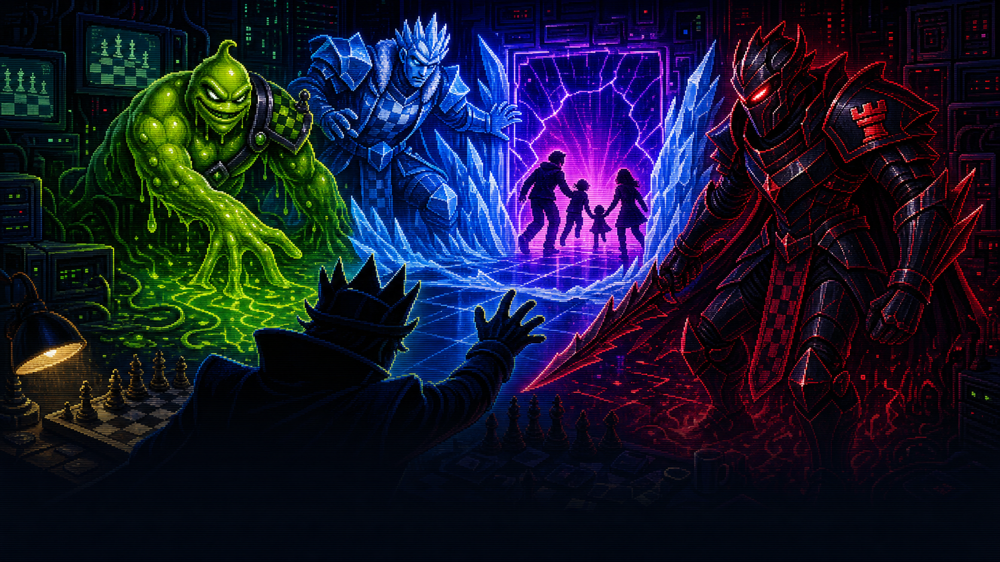</td>
  </tr>
  <tr>
    <td><strong>PRE-COMPUTATION</strong><br>The brilliant player studies the impossible prime.</td>
    <td><strong>THE BREACH</strong><br>Goop, Frostd4d, and Razorblade tear open the lab and kidnap his family.</td>
  </tr>
  <tr>
    <td>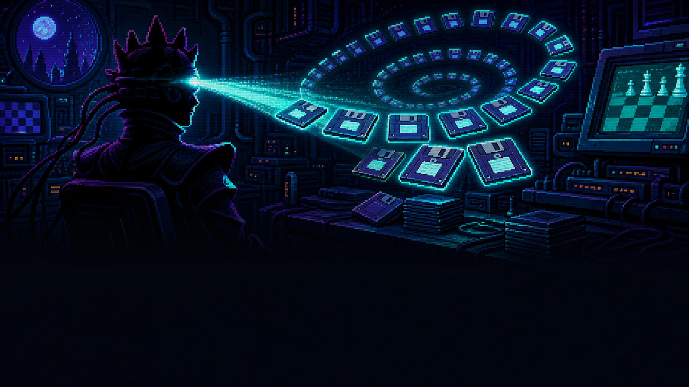</td>
    <td>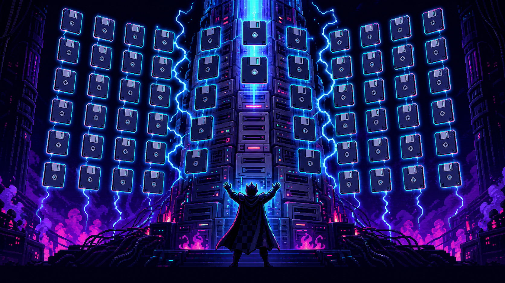</td>
  </tr>
  <tr>
    <td><strong>42 DISKS</strong><br>He transfers his mind onto forty-two floppy disks.</td>
    <td><strong>FLOPPY TOWER ONLINE</strong><br>The disks load one by one. The room becomes light.</td>
  </tr>
  <tr>
    <td colspan="2">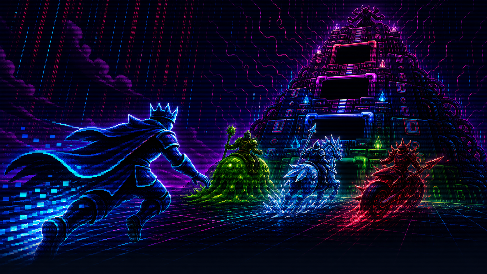</td>
  </tr>
  <tr>
    <td colspan="2"><strong>CYBERSPACE</strong><br>Now he must climb the tower, beat the Shannon Knights, save his family, and find the prime at the center of chess.</td>
  </tr>
</table>

---

## YOUR MISSION

<p align="center">
  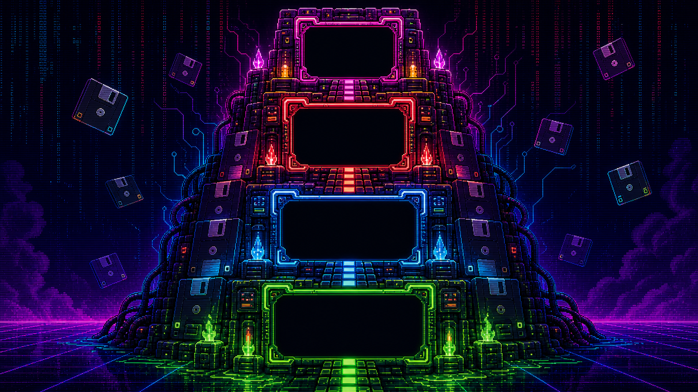
</p>

Ascend the Floppy Tower. You do not pick your opponent. You rise.

Start at the bottom with Goop, push through Frostd4d and Razorblade, then face GORDO at the tower core. You have two lives for the full run. Lose once and the continue clock starts. Lose twice and the cabinet owns your score.

---

## KNOW YOUR ENEMIES

<table>
  <tr>
    <th>FLOOR 1</th>
    <th>FLOOR 2</th>
    <th>FLOOR 3</th>
    <th>FINAL FLOOR</th>
  </tr>
  <tr>
    <td>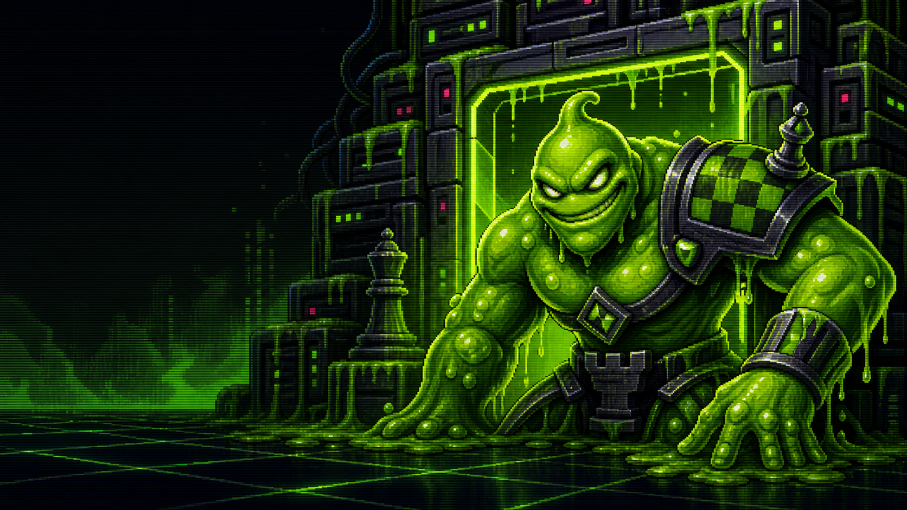</td>
    <td>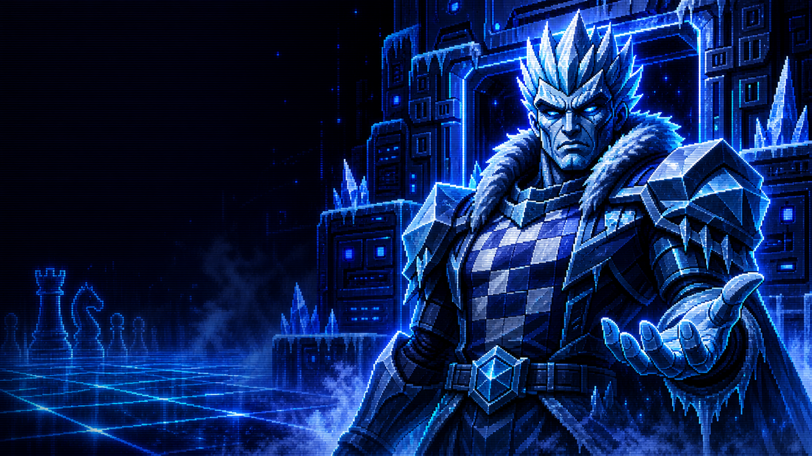</td>
    <td>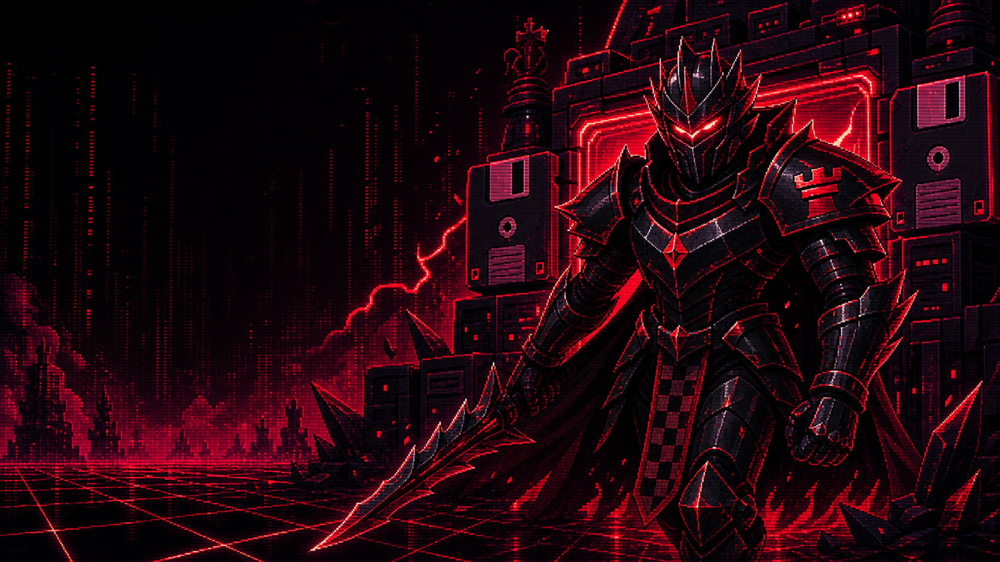</td>
    <td>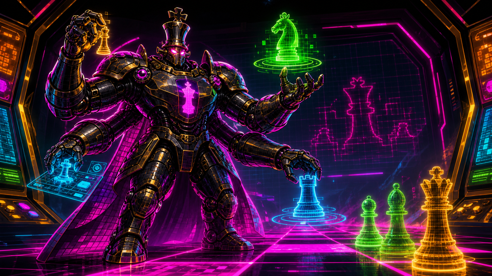</td>
  </tr>
  <tr>
    <td><strong>GOOP</strong><br>Easy<br>Mostly legal. Frequently sticky.</td>
    <td><strong>FROSTD4D</strong><br>Medium<br>Cold reads, colder captures.</td>
    <td><strong>RAZORBLADE</strong><br>Hard<br>Depth search with bad intentions.</td>
    <td><strong>GORDO</strong><br>Final<br>Four arms. One engine. No mercy.</td>
  </tr>
  <tr>
    <td>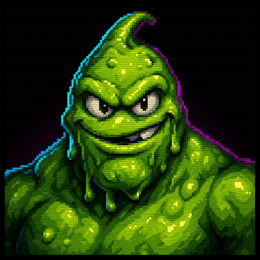</td>
    <td>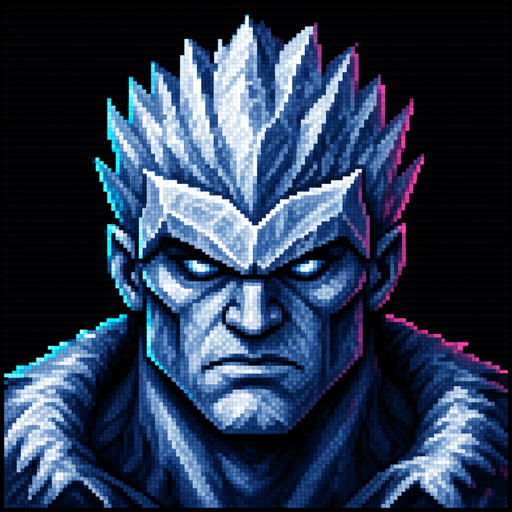</td>
    <td>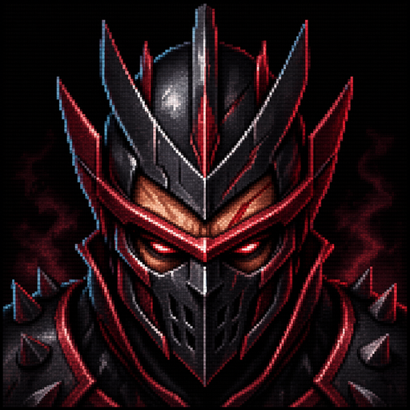</td>
    <td>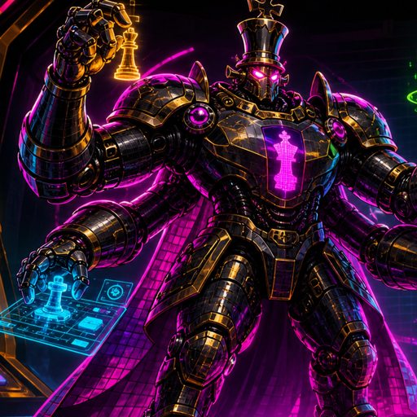</td>
  </tr>
</table>

Each enemy brings a custom arena mood: Goop glows green, Frostd4d freezes the background blue, Razorblade stains the board red, and GORDO floods the tower core with magenta and amber.

---

## VICTORY AND DEFEAT

<table>
  <tr>
    <td width="50%">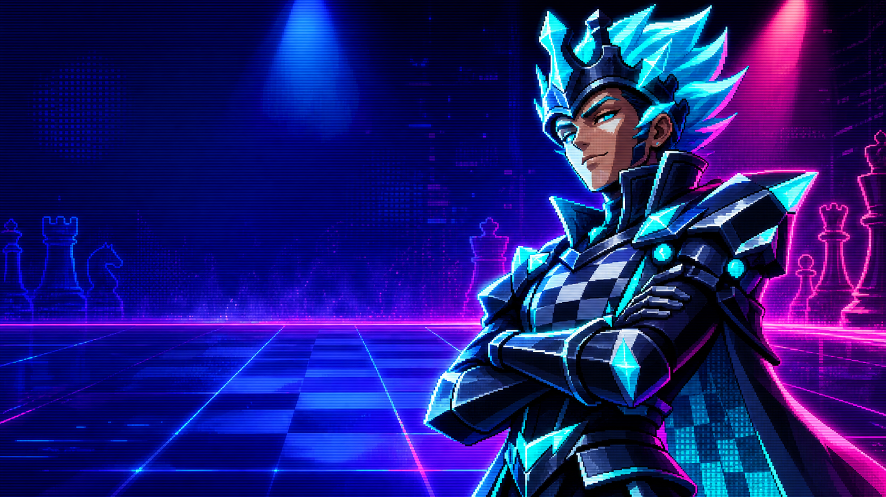</td>
    <td width="50%">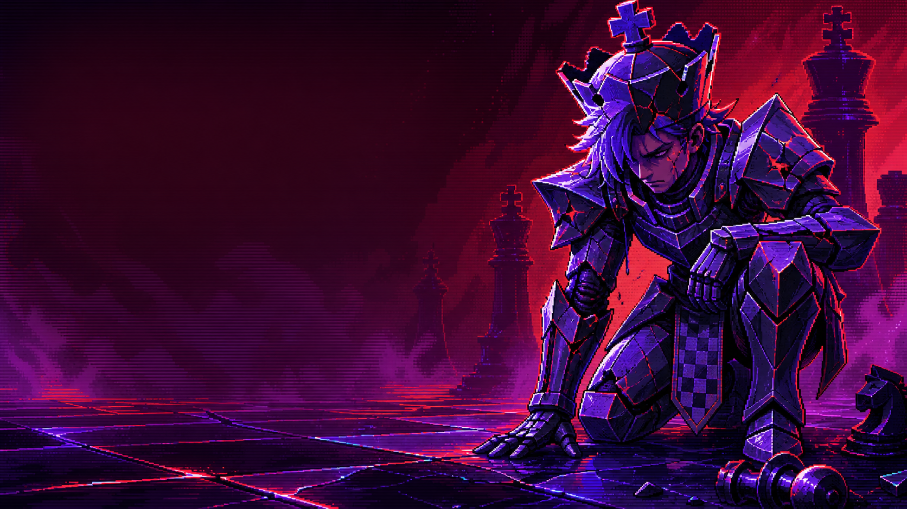</td>
  </tr>
  <tr>
    <td><strong>YOU WIN</strong><br>Clear a floor and the next challenger appears.</td>
    <td><strong>YOU LOSE</strong><br>Hit continue before the countdown expires.</td>
  </tr>
</table>

---

## HOW TO PLAY

1. Click `CLICK TO ENTER`.
2. Watch or skip the story sequence.
3. Enter your fighter name.
4. Choose `Play White` or `Play Black`.
5. Press `CONTINUE`, review the tower floor, then press `ASCEND`.
6. Click a piece, then click a legal destination square.
7. Checkmate the current enemy to climb to the next floor.
8. Clear Goop, Frostd4d, Razorblade, and GORDO to post a local leaderboard score.

Controls:

- Mouse or trackpad: select and move pieces.
- `Reset`: restart the current matchup.
- `Menu`: return to the intro and setup flow.
- `CONTINUE`: spend your remaining life after a loss.

---

## WHAT IS IN THE CARTRIDGE

- 3D chess board built with React, Three.js, and chess.js.
- Animated FBX chess pieces.
- Three local AI personalities plus GORDO, a final boss backed by the embedded Lozza chess engine worker.
- Fixed floppy-tower campaign progression.
- Two-life continue system.
- Player name registration.
- Smart 3D board labels: white name on the white side, black name on the black side.
- Local leaderboard saved in `localStorage`.
- Browser-generated chiptune intro music.
- Browser-generated gameplay SFX for menu actions, reveals, moves, captures, checks, wins, losses, and countdown ticks.
- Settings panel with Full Audio, SFX Only, and Muted modes.
- Generated moniker-themed settings background art.
- Imported announcer clips for tower opponent reveals.
- Imported loading-screen music for the menu and tower flow.
- Generated story, enemy, tower, victory, and defeat art.
- Embedded Lozza chess engine worker, included under its MIT license in `media/engines/`.
- ElevenLabs SFX prompt notes in `media/sfx/README.md` for future static sound assets.

---

## HOW CODEX HELPED

Codex helped turn the prototype into a playable static browser game, build the campaign structure, debug the board-name placement, add the player profile and local leaderboard, create the story/tower/enemy art direction, generate the image assets, add Web Audio music and SFX, and verify the game with automated browser smoke tests.

---

## RUN LOCALLY

```bash
npm install
npm start
```

Open `http://127.0.0.1:5173/`.

## REBUILD

The built `app.js` is committed so GitHub Pages can serve the game directly.

```bash
npm install
npm run build
```

## VERIFY

```bash
npm run smoke
```

To verify a deployed copy:

```bash
SMOKE_URL=https://newjordan.github.io/codex-chess/ npm run smoke
```

## HOSTING

Serve the repository root so `index.html`, `app.js`, `media/`, `avatars/`, and `pieces_fbx/` are all available at the same base path.

To generate a Pages-friendly static output directory:

```bash
npm run build:pages
```

Publish `dist/` from GitHub Pages or an Actions deploy step.
